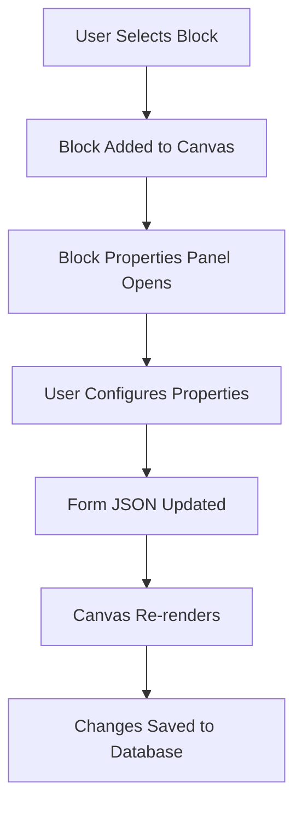

# Form Builder Architecture Documentation

## 📋 Overview

This document explains how the form creation system works in the AI Form Creator application, detailing the component architecture, data flow, and backend integration with Neon database.

## 🏗️ Architecture Overview

The form builder consists of three main sections working together to create a seamless form building experience:

1. **Theme Customizer & AI Assistant** (Sidebar)
2. **Form Canvas** (Center - Form Preview/Builder)
3. **Layout Block Properties** (Right Sidebar - Component Configuration)

## 📂 File Structure

```
app/(routes)/dashboard/
├── page.tsx                    # Main dashboard with form grid
├── form/builder/[formId]/      # Form builder interface
├── _components/
│   ├── Builder.tsx             # Main form builder container
│   ├── BuilderCanvas.tsx       # Form preview/canvas area
│   ├── BuilderSidebar.tsx      # Left sidebar with blocks
│   ├── BuilderBlockProperties.tsx # Right sidebar for properties
│   ├── FormBuilder.tsx         # Form builder wrapper
│   └── _common/
│       ├── FormBlockBox.tsx    # Theme customizer & block library
│       ├── FormItem.tsx        # Individual form card display
│       └── Header.tsx          # Builder header
```

## 🎯 Section 1: Theme Customizer & AI Assistant (Left Sidebar)

### Component: `FormBlockBox.tsx`
**Location**: `/app/(routes)/dashboard/_components/_common/FormBlockBox.tsx`

#### Purpose:
- **Theme Customization**: Color schemes, fonts, background styles
- **AI Assistant Integration**: Intelligent form generation
- **Block Library**: Available form components (Text, Date, Dropdown, etc.)

#### Key Features:
```tsx
// Theme customization with real-time preview
const handleColorPresetChange = (colorValue: string) => {
  updateCustomization({ colors: selectedColor });
};

// AI assistance for automated form creation
<AIAssistanceBtn />

// Block categorization
const basicFields = ["TextField", "TextArea", "Paragraph", "Heading"];
const advancedFields = ["RadioSelect", "StarRating", "DatePicker", "Dropdown"];
```

#### Integration Points:
- **Theme Context**: `useTheme()` - Manages global theme state
- **Builder Context**: `useBuilder()` - Manages form building state
- **Form Blocks Registry**: `FormBlocks` - Available components library

## 🎯 Section 2: Form Canvas (Center Area)

### Component: `BuilderCanvas.tsx`
**Location**: `/app/(routes)/dashboard/_components/BuilderCanvas.tsx`

#### Purpose:
- **Live Form Preview**: Real-time visualization of the form being built
- **Drag & Drop Interface**: Interactive form building
- **Form Submission Simulation**: Test form functionality

#### Key Features:
```tsx
// Canvas component renders form blocks
{blockLayouts?.map((blockLayout) => (
  <ChildCanvasComponentWrapper
    key={blockLayout.id}
    blockLayout={blockLayout}
  />
))}

// Drag and drop functionality
<DndContext sensors={sensors} onDragEnd={onDragEnd}>
  <div className="form-canvas">
    {/* Form blocks render here */}
  </div>
</DndContext>
```

#### Block Types Rendered:
- **Layout Blocks**: Row containers for organizing fields
- **Field Blocks**: Individual form inputs (text, date, dropdown, etc.)
- **Canvas Components**: Preview versions of form elements

## 🎯 Section 3: Layout Block Properties (Right Sidebar)

### Component: `BuilderBlockProperties.tsx`
**Location**: `/app/(routes)/dashboard/_components/BuilderBlockProperties.tsx`

#### Purpose:
- **Dynamic Configuration**: Real-time property editing
- **Field Validation**: Input constraints and rules
- **Component Customization**: Labels, placeholders, styling

#### Key Features:
```tsx
// Dynamic property rendering based on selected block
{selectedBlockLayout && (
  <PropertiesComponent
    blockInstance={selectedBlockLayout}
    parentId={parentId}
    positionIndex={positionIndex}
  />
)}

// Real-time updates to form structure
const updateChildBlock = (parentId, childId, updatedBlock) => {
  // Updates form JSON structure immediately
};
```

#### Property Types:
- **Basic Properties**: Label, placeholder, helper text
- **Validation Rules**: Required fields, min/max values
- **Display Options**: Visibility, styling, formatting
- **Advanced Settings**: Conditional logic, custom validation

## 🔄 Component Interaction Flow

### 1. Form Creation Process



### 2. Data Flow Between Components

#### Theme Customizer → Canvas
```tsx
// Theme context provides styling to canvas
const { theme, customization } = useTheme();
// Canvas applies theme to rendered blocks
```

#### Sidebar → Canvas
```tsx
// Block selection triggers canvas update
const addBlockLayout = (blockLayout) => {
  setBlockLayouts([...blockLayouts, blockLayout]);
};
```

#### Canvas → Properties
```tsx
// Clicking block opens properties panel
const handleSeletedLayout = (blockLayout) => {
  setSelectedBlockLayout(blockLayout);
};
```

#### Properties → Canvas
```tsx
// Property changes update form structure
const updateChildBlock = (parentId, childId, updatedBlock) => {
  // Updates blockLayouts state
  // Canvas re-renders with new properties
};
```

## 🗄️ Backend Integration (Neon Database)

### Database Schema

#### Forms Table
```sql
CREATE TABLE "Form" (
  id INTEGER PRIMARY KEY DEFAULT nextval('Form_id_seq'),
  formId UUID UNIQUE NOT NULL DEFAULT gen_random_uuid(),
  userId TEXT NOT NULL,
  name TEXT NOT NULL,
  description TEXT NOT NULL DEFAULT '',
  jsonBlocks TEXT NOT NULL DEFAULT '[]',
  views INTEGER NOT NULL DEFAULT 0,
  responses INTEGER NOT NULL DEFAULT 0,
  published BOOLEAN NOT NULL DEFAULT false,
  createdAt TIMESTAMP WITH TIME ZONE DEFAULT now(),
  updatedAt TIMESTAMP WITH TIME ZONE DEFAULT now(),
  creatorName TEXT NOT NULL,
  settingsId INTEGER NOT NULL,
  active BOOLEAN NOT NULL DEFAULT true,
  
  CONSTRAINT fk_form_settings FOREIGN KEY (settingsId) 
    REFERENCES FormSettings(id)
);
```

#### FormSettings Table
```sql
CREATE TABLE "FormSettings" (
  id INTEGER PRIMARY KEY,
  primaryColor TEXT NOT NULL,
  backgroundColor TEXT NOT NULL,
  createdAt TIMESTAMP WITH TIME ZONE DEFAULT now(),
  updatedAt TIMESTAMP WITH TIME ZONE DEFAULT now()
);
```

### Backend Actions

#### Form Creation Flow
```typescript
// 1. Create Form Settings
const settings = await prisma.formSettings.create({
  data: {
    primaryColor: "#8b5cf6",
    backgroundColor: "#ffffff"
  }
});

// 2. Create Form Record
const form = await prisma.form.create({
  data: {
    name: formName,
    description: formDescription,
    userId: user.id,
    creatorName: user.given_name,
    settingsId: settings.id,
    jsonBlocks: JSON.stringify(blockLayouts), // Form structure
    published: false,
    active: true
  }
});
```

#### Form JSON Structure
```json
{
  "blockLayouts": [
    {
      "id": "block_1",
      "blockType": "RowLayout",
      "childrenBlocks": [
        {
          "id": "field_1",
          "blockType": "TextField",
          "attributes": {
            "label": "Name",
            "required": true,
            "placeholder": "Enter your name"
          }
        }
      ]
    }
  ]
}
```

## 🔄 Form Building Workflow

### Manual Form Creation Steps:

1. **Start Building**
   ```tsx
   // User clicks "Create Form" or opens existing form
   router.push(`/dashboard/form/builder/${formId}`);
   ```

2. **Theme Setup**
   ```tsx
   // User selects theme from FormBlockBox
   updateCustomization({ colors: selectedColors });
   ```

3. **Add Layout Structure**
   ```tsx
   // User drags RowLayout from sidebar to canvas
   addBlockLayout(newRowLayout);
   ```

4. **Add Form Fields**
   ```tsx
   // User drags TextField, DatePicker, etc. into rows
   updateBlockLayout(parentId, [...childrenBlocks, newField]);
   ```

5. **Configure Properties**
   ```tsx
   // User clicks field to open properties panel
   handleSeletedLayout(selectedBlock);
   // Properties component renders based on block type
   ```

6. **Real-time Updates**
   ```tsx
   // Changes immediately reflect in canvas
   updateChildBlock(parentId, childId, updatedBlock);
   ```

7. **Save to Database**
   ```tsx
   // Form auto-saves or manual save triggers
   await saveFormContent(formId, JSON.stringify(blockLayouts));
   ```

### AI-Assisted Form Creation:

1. **AI Prompt Input**
   ```tsx
   // User describes form requirements
   "Create a contact form with name, email, and message fields"
   ```

2. **AI Processing**
   ```tsx
   // AI generates form structure based on prompt
   const generatedBlocks = await generateFormBlocks(prompt);
   ```

3. **Auto-Population**
   ```tsx
   // Generated blocks automatically added to canvas
   setBlockLayouts(generatedBlocks);
   ```

## 🎛️ Context Providers

### Builder Context
```tsx
// Manages form building state
const BuilderContext = {
  formData,           // Current form data
  blockLayouts,       // Form structure
  selectedBlockLayout, // Currently selected block
  addBlockLayout,     // Add new block
  updateChildBlock,   // Update block properties
  removeBlockLayout   // Delete block
};
```

### Theme Context
```tsx
// Manages theme and customization
const ThemeContext = {
  theme,              // light/dark mode
  customization,      // colors, fonts, spacing
  updateCustomization, // Update theme settings
  resetCustomization  // Reset to defaults
};
```

## 🚀 Key Features

### Real-time Collaboration
- **Live Updates**: Changes reflect immediately across all sections
- **State Synchronization**: All components stay in sync via context

### Responsive Design
- **Grid Layout**: Adaptive form card display
- **Mobile Friendly**: Touch-optimized drag and drop

### Data Persistence
- **Auto-save**: Form changes saved automatically
- **Version Control**: Form history and rollback capability
- **Soft Deletes**: Forms marked inactive instead of deleted

## 🔍 Debugging & Development

### Common Issues:
1. **Hydration Errors**: Fixed with client-side mounting checks
2. **Context Errors**: Ensure components wrapped in providers
3. **Type Mismatches**: Form data structure validation

### Development Tips:
- Use React DevTools to inspect context state
- Check Network tab for API calls to Neon database
- Verify Prisma schema matches database structure

## 📈 Performance Considerations

- **Lazy Loading**: Form blocks loaded on demand
- **Memoization**: Expensive calculations cached
- **Optimistic Updates**: UI updates before database confirmation
- **Database Indexing**: Optimized queries for form retrieval

This architecture provides a scalable, maintainable form building system with real-time collaboration, AI assistance, and robust data persistence to Neon PostgreSQL database.
